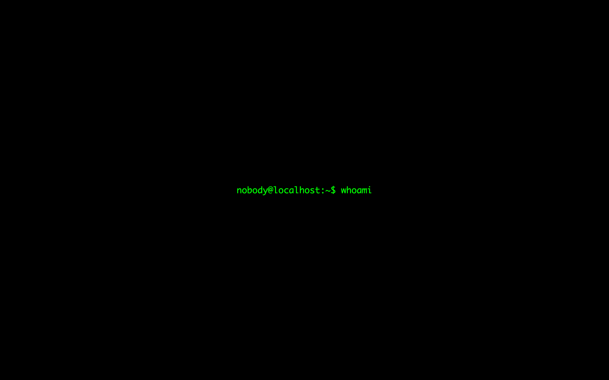

## Examples

## Pull requests

Feel free to submit pull requests. Pull requests sould follow these rules:

- The only added file should be an HTML file in the ``src/`` folder, based upon ``src/example.html``.
- The text should be programming related, but doesn't have to be strictly a programming language.
- Only use 2 flat colors.
